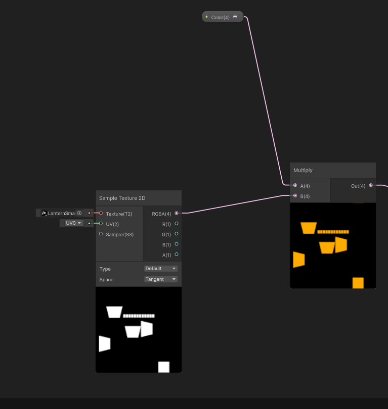
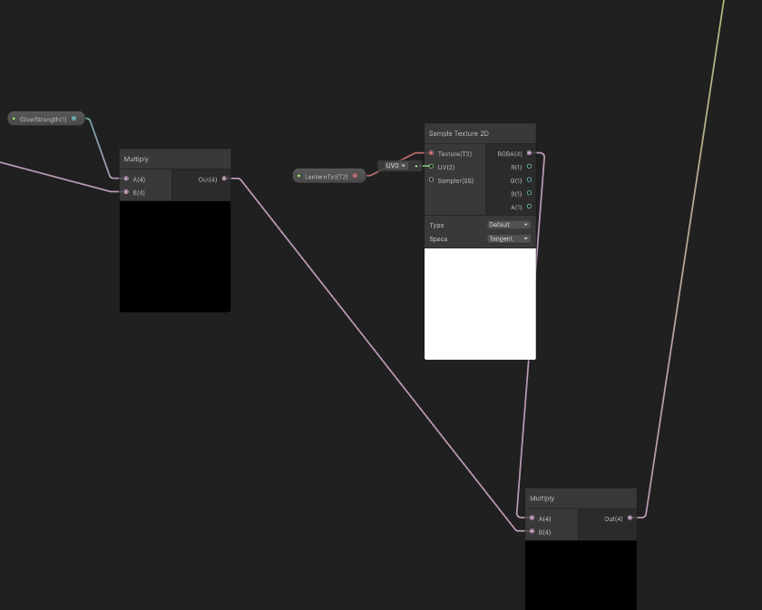

# IntroToCGGolfGame

SHADERS:
- Emission
This shader wasn't part of any of the lighting models shown in class and is completley custom. This shader's purpose is to take in an emmission map and have the ability to not only change the colour of it but also make it glow using unity's lit shader graph. 

This part grabs the emission map and gives the white parts a colour. The white part of the map tells you what is bright and the black tells you what is dark. 

Afterwards, I multiplied it with a float so the shader can actually glow and have power according to the settings the particular object/scene needs. Then, it is multiplied with the 
base colour map so it is not completely flat and still has some painted, material texture. The node is then plugged into the emmission channel of the fragment shader. 

- Normal + Height Map Shader
This is very similar to the bump shader we learned in class but rather than a bump map, it’s a normal map instead. I made this shader for the wood materials to make them look 3D without having to change the geometry as the wooden objects are the most detailed in texture. I slightly changed the original bump shader by converting the sample texture to a “normal” type, then I did essentially the same process by multiplying by a customizable float and plugging that into a dot product node with a light direction. 
For the height texture, I multiplied it by a customizable height amount float which is multiplied again with a view direction. That product is put in a subtract node with a UV node so the object can look like it sticks out more in some parts with the offset. This is plugged into a colour base texture sample node, then multiplied with a colour. I tried to also add in some ambient lighting before they all hit the colour shader.

- Specular + Reflect Shader
I wanted to make a shader for reflective surfaces like the metal saw blade which not only reflected the environment but had specular lighting to emphasize it’s metallic texture as well as a base colour that is tweakable to mimic roughness without needing a rough map or metallic map. Unlike the regular simple specular shader, I tweaked some of the properties and nodes so that the colour is always present and isn’t just totally dark on one side and I added reflectance to it to further show the shininess of the saw’s metal surface. 
