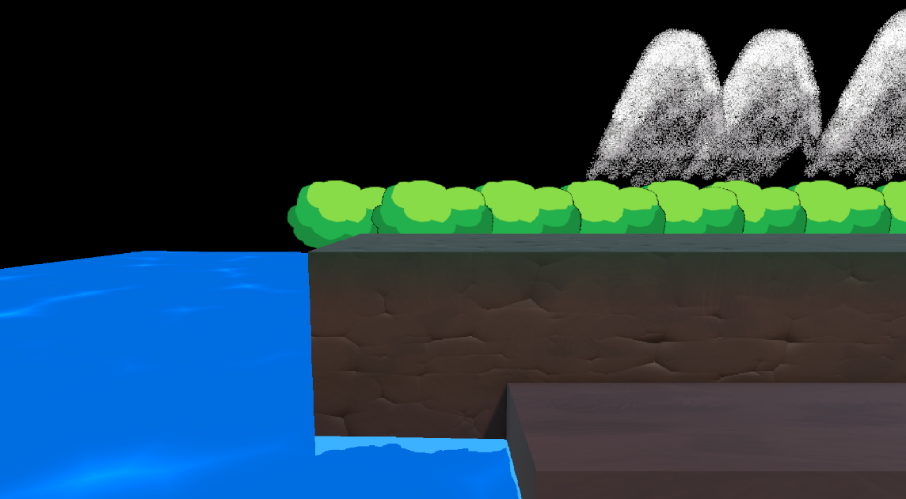
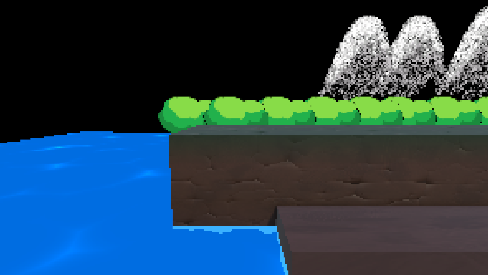
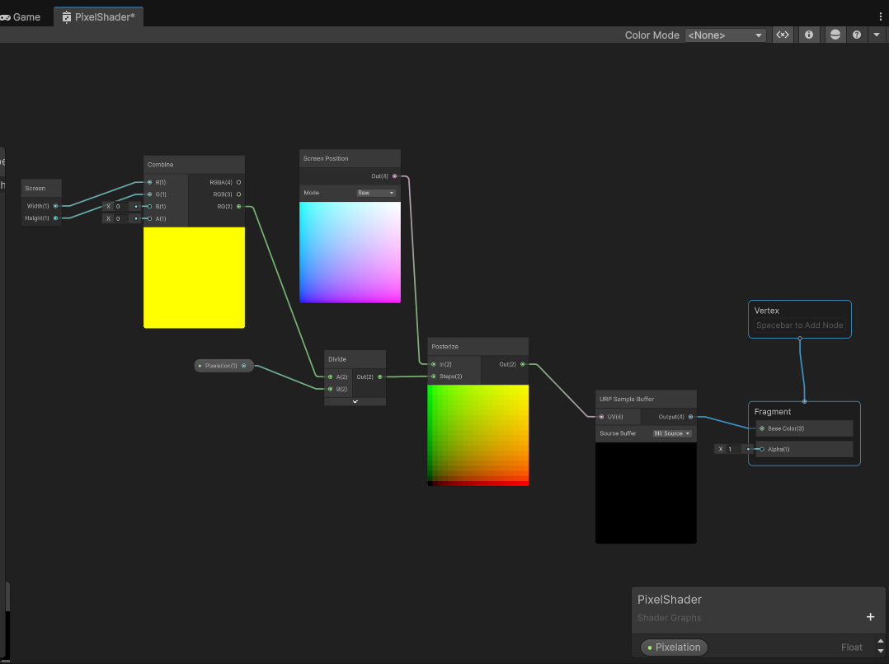
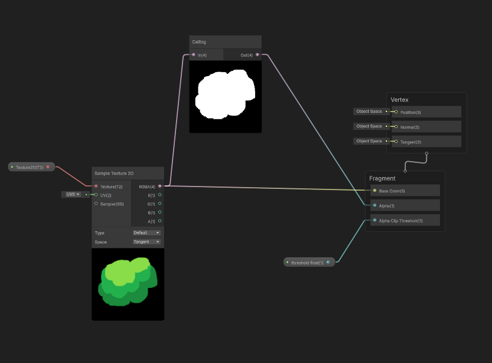

# ContraActivityForBonus

SHADERS for Contra:

-Jason's shaders
Water shader: 
Made to create a foam effect around terrain. The reason for this new water shader is because it creates a more realistic and dynamic water effect. This water has a scrolling texture on it and a wavy effect that makes it look like the waves are actually moving. Having more dynamic water (if kept at a reasonable amplitude and speed) makes the scene feel more alive and interesting to play in than a flat water effect that Contra had. 

Terrain shader: 
Next I made a terrain shader that applies a simple tiling texture that makes things look like it was painted with a brush. This texture is grayscaled so I used vertex colors to make it actually grass and rock colored. I used vertex painting in blender to get the vertex colors. After applying the vertex colors over the texture, I also applied a rocky normal map to make the terrain look less flat. The terrain is still flat to keep the simple blockiness of Contra, but the extra rocky texture enhances the style of the terrain. The rocky texture helps sell that the player is standing on terrain and for areas where terrain overlap, there is some contrast between the grass and the rocky wall behind the player in terms of texture (adding a sense of depth). The way the rocky texture is by using vertex colors as a mask. Because I knew the green areas should be less rocky, I took the green channel of vertex colors and masked the rocky normal map and cracks. this helps to save on space as well because its reusing the data from vertex colors. 

-Kate's Shaders
Transparency Shader:
This transparency shader was made for the flat sprites in the background of the Contra game. This includes things like the bushes and mountains. I made this shader because the transparency makes it so that those flat sprites remain as a small detail in the background and is very distinguishable from the player layer. The shader makes it so that any sprite can be applied to it as a texture map and the sprite will be transparent for any black parts on the image itself. I think this is also very useful for the game because there really is not much utilization for the colour black, and with the sky being the only thing that is truly black, this shader works for all the background sprite elements.

Pixel Shader:
This shader is applied to the active renderer and makes all things in the scene visually pixelated to a certain amount. Whether the camera zooms in or out, the number of pixels will always remain the same. I created this shader because Contra itself is a pixelated game. I think this shader really helps bring things to a more consistent style because without it, there is a super cartoonish water and a super rendered terrain with 2D cartoony background sprites. With the shader, it makes everything more cohesive in quality and style. It brings out the flat colours in all the shapes that are necessary for a pixel style, making it quite cartoonish overall. So this visually definitley benefits the environment by making things more visually clear (clear colour values and contrast) and consistent.

Photos:

